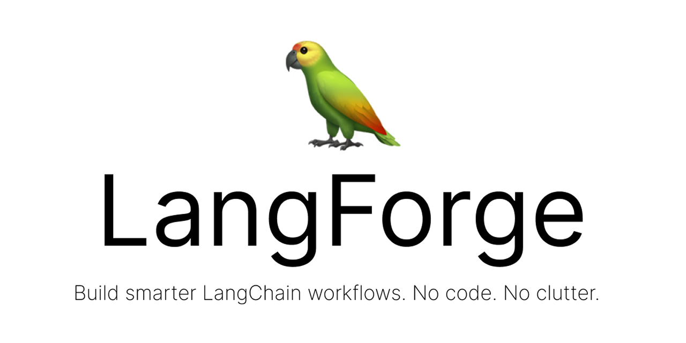

# LangForge

  

The visual IDE for crafting, testing, and exporting LangChain-ready prompt chains.
Design prompts like a pro, visualize logic flows, validate with AI, and export production-ready chains — all in one elegant workspace.

---

## What is LangForge?

LangForge is a powerful, modern prompt engineering environment that brings together:

- **Visual Canvas** – Drag-and-drop nodes to build chains, logic, and flows  
- **Code-First Editor** – Real-time prompt editor with input validation, testing, and versioning  
- **LangChain & LangGraph Export** – One-click export to clean, runnable LangChain Python code  
- **Analytics & Scoring** – Auto-generated prompt scores, token usage, failure rates, and version insights  
- **Auto Prompt Testing** – GPT-4 generates and runs tests to validate your prompt quality  
- **Smart Templates** – Build from LangGraph-style blueprints with editable prompts in canvas + editor

---

## Features

- **Bi-directional Editor ↔ Canvas Sync**  
  Edit anywhere, see changes everywhere. Keep your logic and prompts unified.

- **Automated Prompt Tests**  
  LangForge uses GPT-4 to auto-generate tests per prompt and assigns pass/fail badges.

- **PromptScore (AI Evaluation)**  
  Evaluate prompts across Clarity, Creativity, and Relevance using AI-based scoring.

- **Chain Types Supported**  
  - `PromptTemplate`, `ChatPromptTemplate`, `SystemMessagePromptTemplate`  
  - `SequentialChain`, `SimpleSequentialChain`, `LLMChain`, `LangGraph`  

- **Model Support**  
  Choose from OpenAI models (GPT-3.5, GPT-4), Groq models (Llama, Gemma, Qwen), and OpenRouter models (Meta, Mistral, Anthropic, Google).

- **Multi-Model Testing**  
  Test your prompts across multiple AI models simultaneously to compare performance and outputs.

- **Variable Management**  
  Dynamic variable system with validation, testing, and real-time preview.

- **Version Control**  
  Track prompt changes, compare versions, and maintain prompt history.

- **Exports**  
  - LangChain-ready Python code  
  - Configuration files (.json/.yaml)  
  - Inline code comments and variable validation

---

## Technology Stack

- **Frontend**: React, TypeScript, Vite
- **Styling**: Tailwind CSS
- **Canvas**: React Flow
- **AI Models**: OpenAI (via OpenRouter), Groq, OpenRouter
- **Authentication**: Supabase
- **Deployment**: Vercel

---

**LangForge** - The visual IDE for crafting prompts and building LangChain logic.
